 

<h1> 👋 A little bit about myself</h2>

I'm a passionate about math, new technologies and computer science.

 

<!-- table -->
<table align='center'>

  <!-- 1st row -->
  <tr>
    <!-- languages -->
    <td  width='50%' align='center'>
      <h3>Languages</h3>
        
      
      
      
      
      
      
       
       
    </td>
    <!-- Framework -->
    <td  align='center'>
      <h3>Framework</h3>
        
      
      
      
      
       
       
       
    </td>
  </tr>
  <!-- 2nd row  -->
 <tr>
    <!-- languages -->
    <td width='50%' align='center'>
      <h3>Online Education</h3>
       
      
      
      
       
       
    </td>
    <!-- Framework -->
    <td  align='center'>
      <h3>Database</h3>
       
      
      
      
       
       
    </td>
  </tr>

  

</table>

<!-- https://dev.to/envoy_/150-badges-for-github-pnk#skills -->

<!-- https://github.com/Ileriayo/markdown-badges#markdown-badges -->

<!-- https://home.aveek.io/GitHub-Profile-Badges/ -->